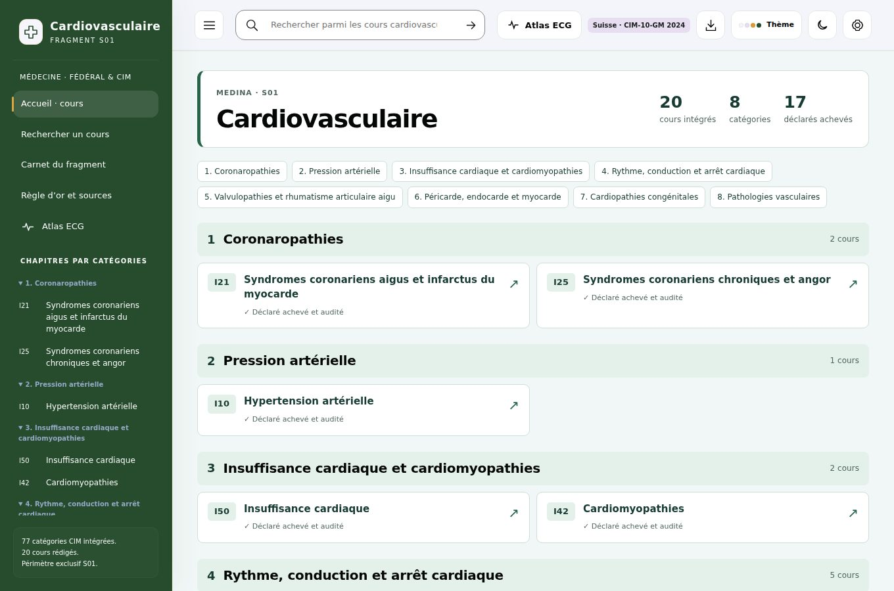
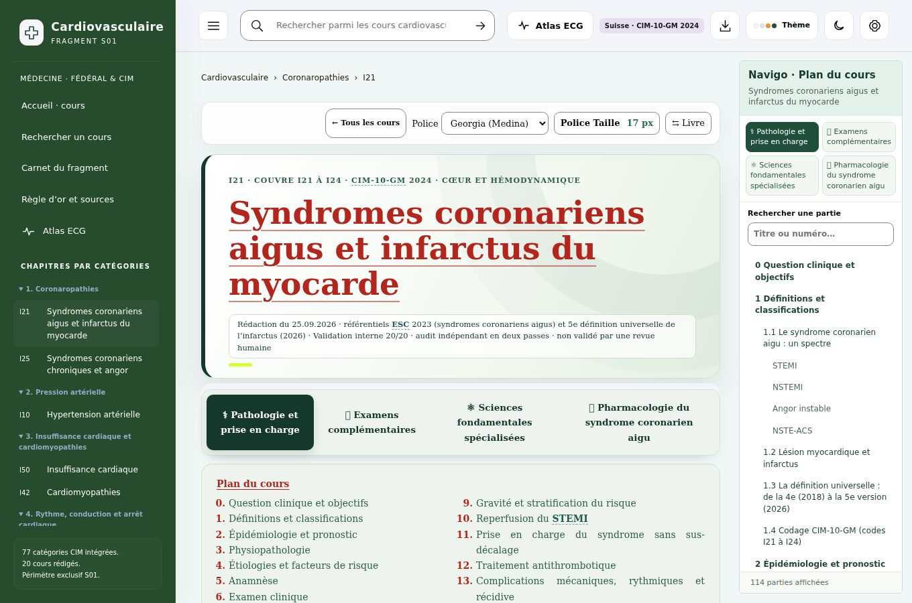
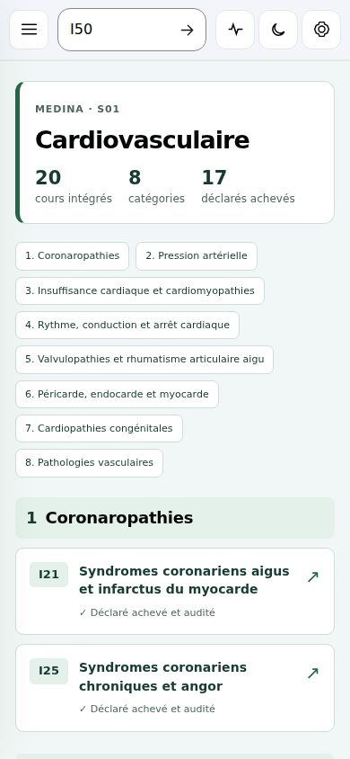
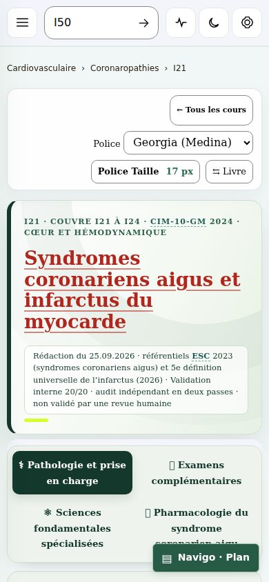
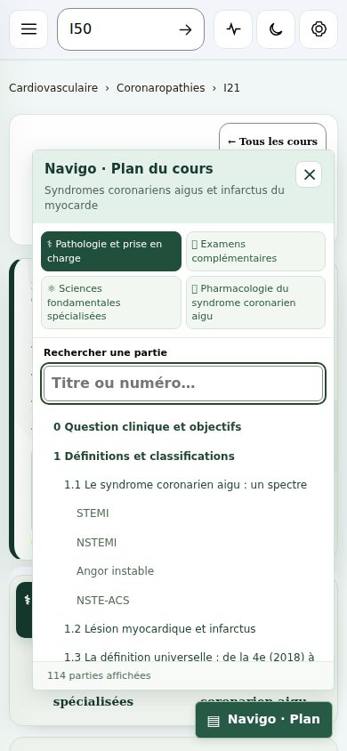

# S01 — Accueil des cours et Navigo

Le fragment cardiovasculaire s’ouvrait sur le catalogue général et présentait 16 spécialités. Il ouvre maintenant les 20 cours réellement intégrés, classés en huit catégories cliniques. Une seule spécialité est conservée : cardiologie, intitulée « Cardiovasculaire ». La recherche, le carnet, les liens et les renvois CIM utilisent ce périmètre.

Le Navigo est un panneau rectangulaire fixe à droite sur ordinateur (largeur minimale 1 100 px), avec un espace réservé hors du texte. Sur téléphone et tablette, un bouton fixe ouvre le plan. Ses quatre onglets, son filtre de titres et ses sauts vers les parties fonctionnent en lecture verticale et en mode Livre. La couverture est lisible immédiatement, sans animation de flou. L’Atlas ECG reste accessible.

La surface est activée uniquement par `surface: courses-v1` dans le manifeste de S01. La coque historique et les sources médicales restent inchangées. Le build S02 a été comparé à sa référence avant modification : identité octet pour octet. Les autres fragments conservent le chemin de construction existant.

## Vérification

- Construction des 22 fragments réussie.
- `tests/audit_fragments.py` : 22 fragments contrôlés, JavaScript valide, build complet reproductible ; contrôle renforcé des cours manquants et du périmètre S01.
- `test_v7.py --static` sur les 20 cours : OK (glossaire, fenêtres, classes et contrat HTML).
- `tests/verify_s01_browser.cjs` : 71 contrôles réussis dans Chromium 153, aucune erreur JavaScript ou console. Ouverture des 20 cours, renvois I22 et Q20, rejet des routes étrangères, recherche, conservation du carnet global, fenêtre d’approfondissement, QCM, taille de police, mode Livre, Navigo et absence de débordement aux largeurs 390, 1 024, 1 100, 1 360 et 1 440 px. Lecture de l’HTML autonome depuis `file://` également vérifiée.
- Le paquet compressé des 1 575 gabarits de cours et de fenêtres est strictement identique avant/après. SHA-256 : `c8108e4d874aa3ed4945b29a34ea7827bacd89240ba3761ff7609ae52271a9cc`.

Les statuts médicaux sont repris des sources : 17 cours déclarés achevés et audités, trois cours vasculaires (I71, I80, I70) dont l’audit reste à compléter. Cette modification concerne l’interface ; aucun nouveau contrôle scientifique n’a été effectué.

## Captures du navigateur







## Reproduire

```bash
python build_front.py --all-fragments
python tests/audit_fragments.py
python test_v7.py --static I21 I25 I10 I50 I42 I48 I44 I47 I49 I46 I35 I34 I00 I30 I33 I40 Q21 I71 I80 I70
# Avec le paquet npm playwright et son navigateur Chromium installés :
node tests/verify_s01_browser.cjs
```

`MEDINA_S01_FILE` peut désigner un HTML construit ailleurs, `MEDINA_QA_OUT` le dossier des résultats et `MEDINA_CHROMIUM_PATH` un exécutable Chromium existant. Les résultats détaillés de cette exécution figurent dans `browser-results.json`.
