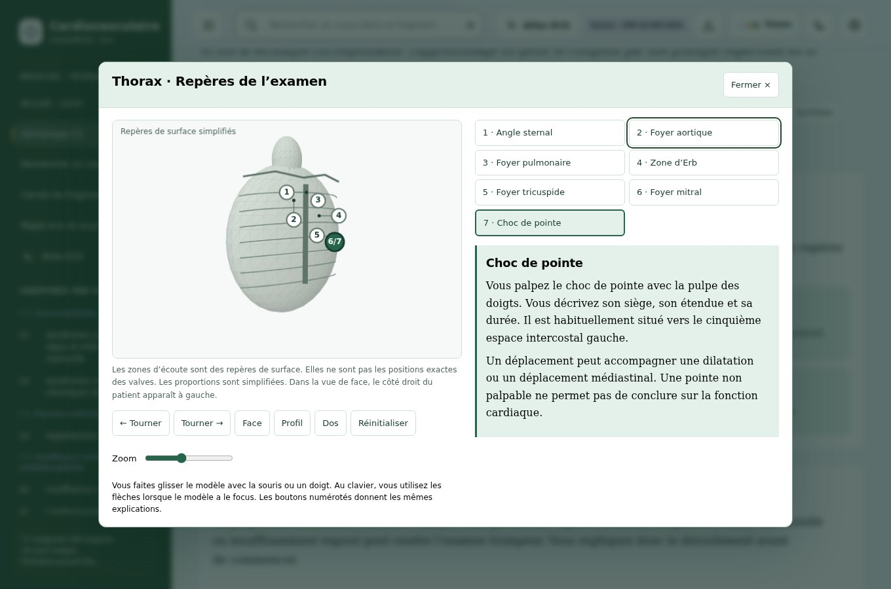
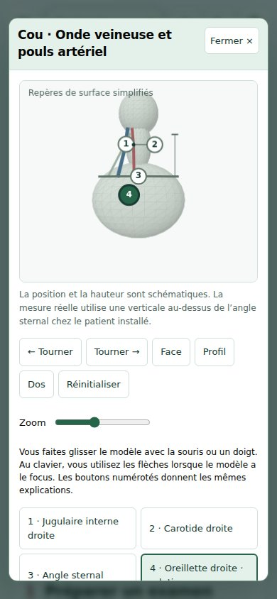
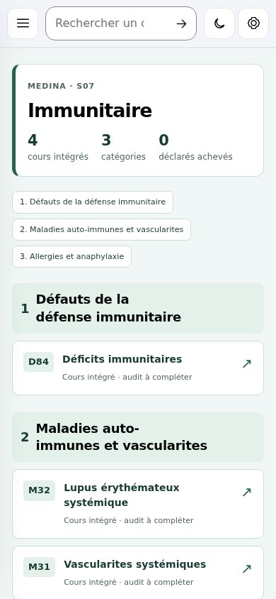
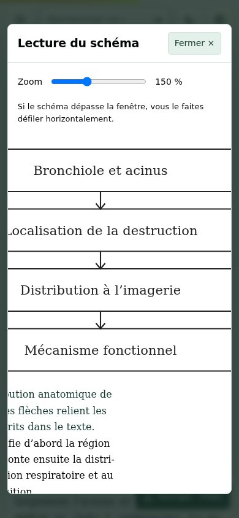

# Sciences fondamentales et Sémiologie CS — livraison du 7 octobre 2026

Cette livraison enrichit les sciences des 30 cours déjà intégrés. Elle ajoute à S01 un examen cardiovasculaire systématique et quatre modèles 3D manipulables en fenêtres. Le travail poursuit ensuite S02, S07, S10 et T1, sans validation intermédiaire du propriétaire.

## Périmètre concret

| Fragment | Cours | Disciplines scientifiques | Figures dans les sciences | Mots dans les panneaux de sciences |
| --- | ---: | ---: | ---: | ---: |
| S01 — Cardiovasculaire | 20 | 98 | 103 | 50 577 |
| S02 — Respiratoire | 4 | 21 | 21 | 8 331 |
| S07 — Immunitaire | 4 | 14 | 14 | 7 252 |
| S10 — Locomoteur | 1 | 3 | 3 | 1 548 |
| T1 — Agents et thérapeutique | 1 | 4 | 4 | 2 124 |
| **Total** | **30** | **140** | **145** | **69 832** |

La base comparable `c50a28a23d7e2a2e0cf8ac36842b567de419daf4` contient 37 286 mots et 75 figures dans ces panneaux. Les fenêtres et le parcours CS ne sont pas inclus dans ces comptages. Les données détaillées figurent dans [science-content-results.json](science-content-results.json). Le volume et les contrats détectent des parties trop brèves ou absentes ; ils ne constituent pas un audit médical.

Toutes les disciplines disposent d'une figure nommée et légendée, de développements et de corrélations explicites vers clinique, examen et traitement. Les réécritures vasculaires et celles des six cours les plus courts suivent le fonctionnement normal, sa perturbation, les limites et un cas interprété. Les autres sciences cardiovasculaires conservent leur contenu de base et reçoivent une interprétation guidée spécifique ainsi que leurs liens cliniques. Les statuts `DONE_COURSES` et d'audit restent inchangés.

## Sémiologie cardiovasculaire

Le parcours CS comprend dix étapes et une section de sources. Il détaille préparation, signes d'instabilité, constantes, pouls, jugulaire et carotide, inspection et palpation du précordium, auscultation, congestion, synthèse et entraînement. Trois cas corrigés vérifient l'interprétation. Une liste de neuf étapes conserve uniquement les cases cochées dans le navigateur du lecteur.

Les quatre modèles sont construits avec une géométrie 3D locale : thorax, cou, sites de pouls et cavités/valves. Une projection avec tri en profondeur produit leur rendu. Rotation, glissement, clavier, vues, zoom et sélection modifient réellement la scène. Les descriptions restent accessibles si Canvas n'est pas disponible. Les repères très proches utilisent des lignes de rappel pour rester lisibles.

Les modèles servent à comprendre les gestes. Ils ne reproduisent pas une imagerie ni des rapports anatomiques exacts. La hauteur jugulaire est mesurée sur le patient, et les foyers d'auscultation sont distingués de la position des valves.

## Vérification technique

- `build_front.py --all-fragments` construit les 22 fragments.
- `tests/audit_fragments.py` contrôle les périmètres, le JavaScript et deux constructions reproductibles.
- `test_v7.py --static` passe pour les 30 cours : classes, identifiants, fenêtres, glossaire, quiz et couvertures Pareto.
- `tests/audit_sciences.py` passe pour les 140 disciplines : contenu, figures accessibles et quatre encadrés attendus.
- [Les 71 contrôles de navigation S01](navigation/browser-results.json) passent dans Chromium.
- [Les 569 contrôles de sciences et CS](science-cs-browser-results.json) passent : cinq périmètres, chaque discipline, téléphone à 390 px avec police 24 px, fenêtres et zoom, modèles aux deux largeurs, rotation, glissement, clavier, focus, Échap, entraînement, corrections et mode sans Canvas.
- [Les 17 fragments hors intervention](unchanged-fragments.json) restent identiques octet par octet à leur construction de base.

Aucune erreur JavaScript n'a été enregistrée dans les deux suites navigateur. Les captures ont été inspectées visuellement. Le confinement du focus et la séparation de deux repères cervicaux ont été corrigés au cours de cette vérification. Les archives fonctionnent depuis `file://`.

## Sources ciblées et portée de la relecture

Les références ont été consultées les 6–7 octobre 2026. Le tableau précise leur rôle ; il ne signifie pas que chaque recommandation et chaque posologie de tous les cours a été de nouveau auditée.

| Domaine | Source primaire ou enseignement institutionnel | Point rapproché du contenu |
| --- | --- | --- |
| Documentation de la FA | [ESC 2024, texte intégral](https://www.swiss-ablation.com/downloadbereich/dateien/2024ESC-compressed.pdf), tableau 6 et section 10.2 | ECG standard, enregistrement ambulatoire et contexte de durée ; distinction avec une alerte optique. |
| Artères périphériques | [AHA/ACC 2024, texte intégral](https://pmc.ncbi.nlm.nih.gov/articles/PMC12782132/) | Catégories d'index cheville-bras et interprétation d'une artère incompressible. |
| Aortopathies | [GeneReviews — Heritable Thoracic Aortic Disease](https://www.ncbi.nlm.nih.gov/sites/books/NBK1120/) | Hétérogénéité moléculaire, phénotype et surveillance familiale. |
| Thrombose veineuse | [ESVS 2021, texte intégral institutionnel](https://orbi.uliege.be/bitstream/2268/288481/1/Kakkos%20K._Eur%20J%20Vasc%20Endovasc%20Surg%20(2021)_61_9-82.pdf) | Limites d'une échographie négative et territoire réellement exploré. |
| Thrombophilies | [Facteur V Leiden](https://www.ncbi.nlm.nih.gov/sites/books/NBK1368/) et [prothrombine](https://www.ncbi.nlm.nih.gov/sites/books/NBK1148/), GeneReviews | Mécanismes et risque relatif ; absence de multiplication automatique ou de traitement indéfini automatique. |
| Sémiologie | [Université de Genève](https://www.medecine.unige.ch/enseignement/etudes/curriculum/data/dc116.htm) ; Stanford Medicine 25 : [jugulaire](https://stanfordmedicine25.stanford.edu/the25/neck-exam-jugular-venous-pressure-measurement.html), [précordium](https://stanfordmedicine25.stanford.edu/the25/precordial.html), [B2](https://stanfordmedicine25.stanford.edu/the25/cardiac.html), [souffles diastoliques](https://stanfordmedicine25.stanford.edu/the25/DiastolicMurmursExam.html), [pression](https://stanfordmedicine25.stanford.edu/the25/bppp.html) | Techniques, repères et limites de l'examen cardiovasculaire. |
| Pression et orthostatisme | [ESC 2024](https://academic.oup.com/eurheartj/article/45/38/3912/7741010) | Technique et interprétation des mesures, avec contexte clinique. |
| Physiologie respiratoire | [OpenStax — échanges gazeux](https://openstax.org/books/anatomy-and-physiology-2e/pages/22-4-gas-exchange) | Distinction entre ventilation, perfusion et échange. |
| Asthme et maladie obstructive | [GINA 2026](https://ginasthma.org/2026-gina-strategy-report/), [GOLD 2026](https://goldcopd.org/2026-gold-report-and-pocket-guide/), [GeneReviews — alpha-1 antitrypsine](https://www.ncbi.nlm.nih.gov/sites/books/NBK1519/) | Versions actuelles repérées ; mécanisme pulmonaire distinct de la rétention hépatique. Les algorithmes thérapeutiques ne sont pas tous réaudités. |
| Pneumonie | [NICE NG250, 2025](https://www.nice.org.uk/guidance/NG250/chapter/recommendations) | Cadre de la réévaluation clinique et de l'exploration adaptée. |
| Embolie pulmonaire | [ESC 2019](https://www.escardio.org/guidelines/clinical-practice-guidelines/all-esc-practice-guidelines/acute-pulmonary-embolism/) et [AHA/ACC 2026](https://professional.heart.org/en/science-news/2026-guideline-for-the-evaluation-and-management-of-acute-pulmonary-embolism-in-adults) | Retentissement ventriculaire droit et distinction entre mécanisme, diagnostic et risque. La nouvelle classification américaine n'est pas intégralement transposée dans tous les onglets. |
| Défense humorale | [GeneReviews — Agammaglobulinémie liée à l'X](https://www.ncbi.nlm.nih.gov/sites/books/NBK1453/) | Tissus lymphoïdes peu développés, phénotype B et interprétation familiale. |
| Lupus rénal | [EULAR 2023](https://doi.org/10.1136/ard-2023-224762) et [KDIGO 2024](https://kdigo.org/guidelines/lupus-nephritis/) | Importance de l'organe, de l'activité et de la chronicité dans la stratégie. |
| Allergies | [WAO 2020, texte intégral](https://pmc.ncbi.nlm.nih.gov/articles/PMC7607509/) | Tryptase normale possible, position adaptée et glucagon de recours avec preuves limitées. |
| Polyarthrite | [EULAR, mise à jour 2025 publiée en 2026](https://doi.org/10.1016/j.ard.2026.01.023) | Distinction entre cible moléculaire et choix clinique ; version actuelle repérée. |
| Vascularites | [EULAR ANCA 2022](https://doi.org/10.1136/ard-2022-223764) et [imagerie 2023](https://doi.org/10.1136/ard-2023-224543) | Diagnostic intégré, gravité d'organe et limites du prélèvement. |
| Sepsis | [SCCM/ESICM 2026, recommandations officielles](https://www.sccm.org/clinical-resources/guidelines/guidelines/surviving-sepsis-campaign-international-guidelines-for-management-of-sepsis-and-septic-shock-2026) | Contrôle du foyer, réévaluation des liquides, cinétique du lactate et absence de test unique. |

Une relecture médicale indépendante reste nécessaire pour certifier les nouveaux développements et les repères. Les anciens paragraphes cliniques conservés n'ont pas tous fait l'objet d'un nouvel audit. Les statuts existants rendent cette limite visible dans les cours.

## Consultation et collaboration

L'archive autonome des cinq fragments enrichis est jointe à la livraison de Vial : décompresser et ouvrir `index.html`. Le [générateur conservé dans le dépôt](../../deliverables/build_review_bundle.py) permet de la reconstruire avec `python3 deliverables/build_review_bundle.py` ; il écrit l'archive dans `dist/review/`.

[Document de collaboration et commandes reproductibles](../../docs/collaboration/MEDINA_S01_2026-10-07.md). Le dépôt et cette branche sont publics. Une autre IA peut les lire et proposer une contribution sur sa propre branche avec ses accès GitHub habituels.

[Mission I48 confiée à Claude](../../docs/collaboration/CLAUDE_I48_ESC2024_2026-10-07.md), [modèle de rapport](../../docs/collaboration/REVIEW_TEMPLATE.md) et [sources canoniques communes](../../docs/collaboration/SOURCES_CANONIQUES.md). La branche de Claude part d'un commit public figé ; sa relecture n'est pas encore reçue. Les tâches désignent un responsable unique et séparent relecture et intégration.

Le nouveau lanceur de navigateur a été vérifié sous Linux : [six contrôles de détection](collaboration/browser-runtime-results.json), dont un lancement réel sans `MEDINA_CHROMIUM_PATH`. Les 71 contrôles de navigation ont aussi été relancés et passent. Les 569 contrôles de sciences et CS documentent le contenu livré ; ce changement de lanceur ne modifie pas le contenu ni les modèles. La détection macOS et Windows reste à exécuter sur ces plateformes.
